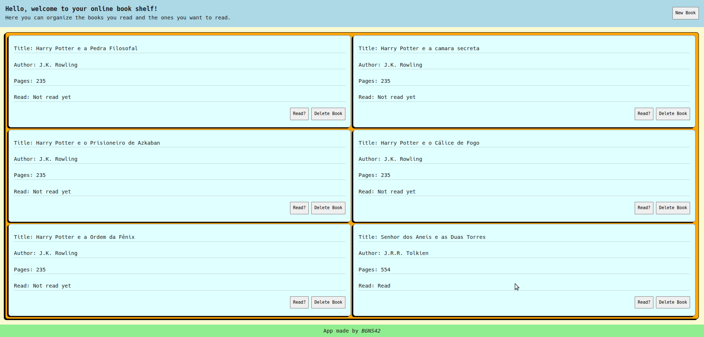
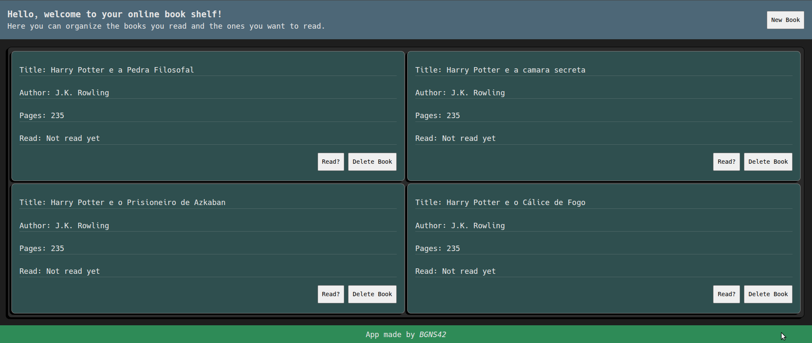
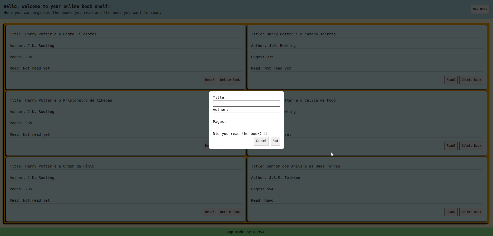
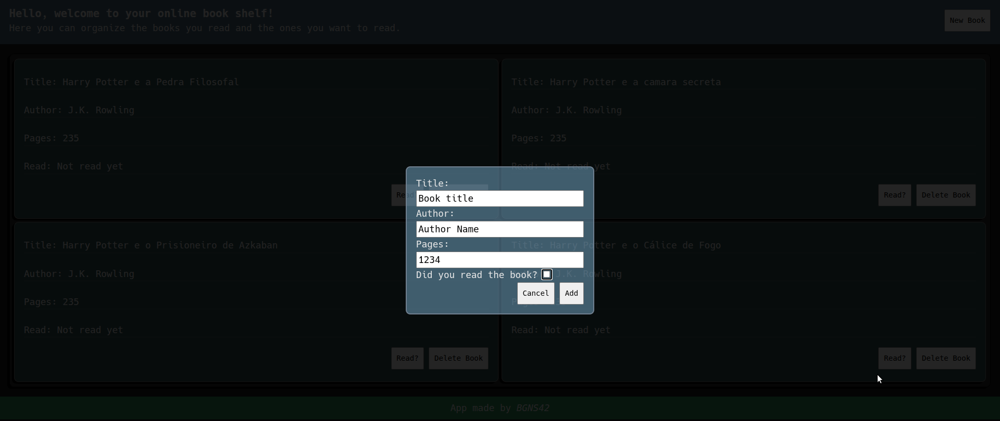
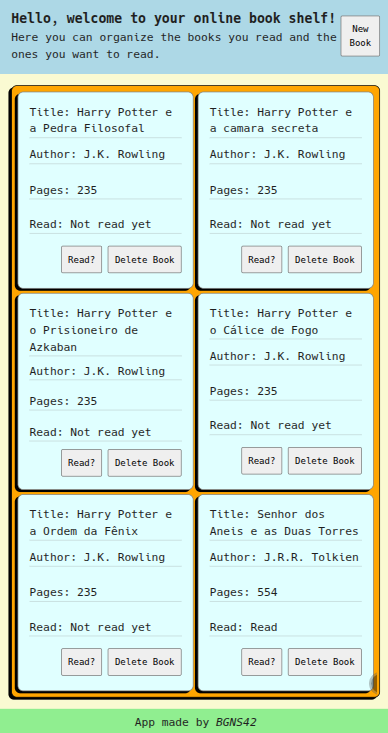
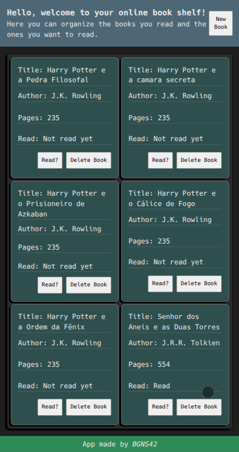

# 📚 JavaScript Library - The Odin Project JavaScript Path
## 🚀 Project Overview

This Library project is part of the JavaScript curriculum from The Odin Project. The goal was to build a dynamic web application where users can add, display, update, and remove books from a personal library using fundamental JavaScript, HTML, and CSS concepts — including objects, constructors, DOM manipulation, and event handling.

## ✨ Features

- **Add New Books:** Users can input book title, author, number of pages, and read status using a form.

- **Book Cards Display:** Each book is dynamically added to a card layout with relevant details.

- **Toggle Read Status:** Easily switch a book's status between "Read" and "Not Read".

- **Remove Book Functionality:** Delete any book from the library instantly.

- **Form Validation:** Prevents submission of incomplete or invalid entries.

- **Responsive Layout:** Works well on various screen sizes using CSS Flexbox.

- **Dark mode:** Color theme based on users preference.

## 🛠️ Technologies Used

**HTML5:** Structured the app semantically, ensuring accessible and meaningful markup.

**CSS3 (Flexbox):** Designed a responsive and clean UI using Flexbox for layout and component organization.

**JavaScript (ES6+):** Managed all application logic — object creation, array manipulation, event listeners, and DOM updates.

## 💡 What I Learned & Reinforced

This project was a great exercise in integrating object-oriented JavaScript with DOM manipulation. Here are some of the key skills and concepts reinforced:

- **Objects & Constructors:** Created a Book constructor function and managed book instances through array manipulation.

- **Array Methods:** Used methods like .push(), .splice(), and .findIndex() to manage the library.

- **DOM Manipulation:** Dynamically created and removed DOM elements based on user interaction.

- **Event Handling:** Handled form submissions, button clicks, and toggle actions with clarity and efficiency.

- **Separation of Concerns:** Organized logic in a modular and readable way for better scalability and maintainability.

## ⚙️ How to Run

Try it live: [Live Demo](https://bgns42.github.io/project-library/)

Or run it locally:
```
git clone https://github.com/BGNS42/project-library.git
cd project-library
```

Then open `index.html` in your preferred browser.

## 📸 Screenshots
Shelf image:



Form example:



Mobile:



## 🚧 Challenges & Solutions
### 🧩 Dynamic DOM Updates

**Challenge:** Ensuring the DOM accurately reflects the current state of the library after every interaction (such as adding, removing, or toggling the read status of a book).

**Solution:** Each book is assigned a unique id using crypto.randomUUID(), which is stored both in the book object and applied as a data-id attribute in the corresponding DOM element. All DOM interactions—like delete or toggle—rely on this id to locate and update the correct book, ensuring precise state synchronization.

## 🔄 Read Status Toggle

**Challenge:** Toggling the read status of a specific book without affecting others or breaking the UI consistency.

**Solution:** The toggle button includes the book’s data-id, which is used to find the matching object in the myLibrary array. Once found, the .read property is updated, and the DOM is re-rendered to reflect the new status visually and functionally.

## ❌ Removing the Correct Book

**Challenge:** Associating the remove button with the correct book object in the array.

**Solution:** Each book card includes a delete button with the book's unique data-id. When clicked, the book is removed from the myLibrary array using filter() based on its id, followed by a full re-render of the library display. This guarantees only the targeted book is removed, preserving data integrity and UI accuracy.

## 👤 Author

Made by [BGNS42](https://github.com/bgns42)

Feel free to connect with me on [LinkedIn](https://www.linkedin.com/in/igor-carrasco/) or explore more of my projects on [GitHub](https://github.com/bgns42).

## 📄 License

This project is open-source and available under the MIT [License](LICENSE).